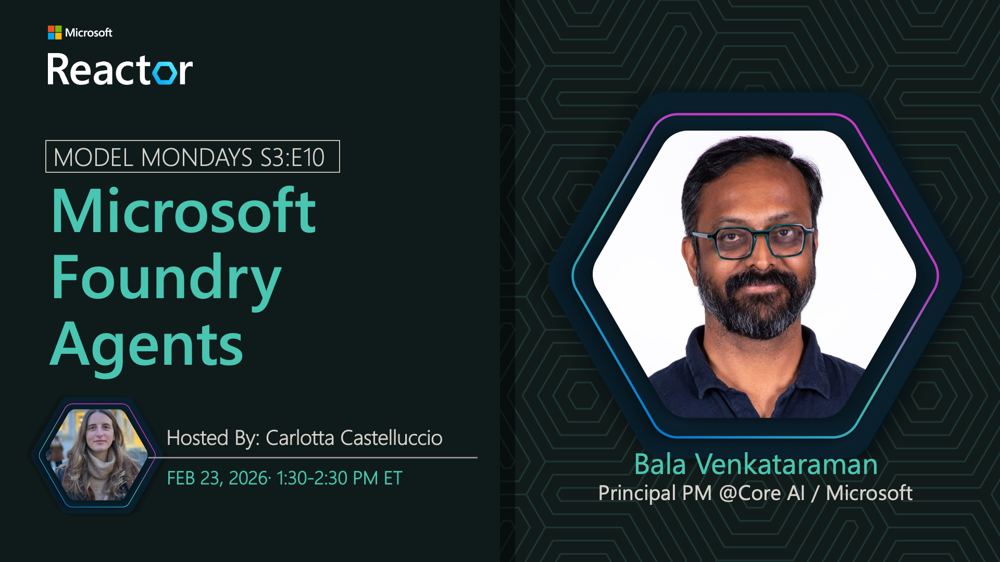

## Foundry Agents

**Date:** February 23, 2026  
**Season:** 3 | **Episode:** 10  
**Host:** [Carlotta Castelluccio](https://linkedin.com/in/carlotta-castelluccio)

### News Highlights

1. [Foundry Agents Platform](https://aka.ms/model-mondays) - Unified agent runtime
2. [AI App Factory](https://aka.ms/model-mondays) - Streamlined development pipeline
3. [Planning to Production](https://aka.ms/model-mondays) - End-to-end workflows
4. [Agent Management](https://aka.ms/model-mondays) - Tools and services
5. [Enterprise Deployment](https://aka.ms/model-mondays) - Production-ready solutions

### Tech Spotlight: Foundry Agents

Microsoft Foundry is your AI app and agent factory. Discover how Foundry Agents provides a unified runtime and comprehensive tools taking you from planning to production with enterprise-grade capabilities.

**Key Features:**
- Unified agent runtime environment
- End-to-end development workflow
- Integrated tools and services
- Production deployment capabilities
- Enterprise management and monitoring

**Speaker:** [Bala Venkataraman](https://linkedin.com/in/vpbala)

_Bala is a Partner Group Product Manager at Microsoft, leading the development of Foundry Agents and unified AI runtime capabilities. He focuses on enabling developers to build and deploy intelligent agent systems at scale._

**Resources:**
- [Foundry Agents Documentation](https://aka.ms/model-mondays)
- [Getting Started Guide](https://aka.ms/model-mondays)
- [Architecture Overview](https://aka.ms/model-mondays)

### Summary

Join Bala Venkataraman as he explores Foundry Agents and the comprehensive platform for building AI applications and agents. Learn how the unified runtime and integrated tools streamline your journey from planning to production deployment.

**Related AMA:** [View AMA Discussion](../foundry-fridays/2026-02-27-s03-e10.md)
