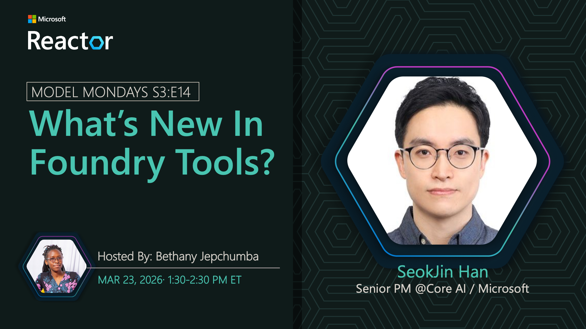

## Foundry Tools & MCP

**Date:** March 23, 2026  
**Season:** 3 | **Episode:** 14  
**Host:** [Lee Stott](https://linkedin.com/in/leestott)

### News Highlights

1. [Foundry Tools Hub](https://aka.ms/model-mondays) - Central tool discovery
2. [Model Context Protocol](https://aka.ms/model-mondays) - MCP server integration
3. [Agent Capabilities](https://aka.ms/model-mondays) - Extended functionality
4. [Tool Integration](https://aka.ms/model-mondays) - Seamless tool connections
5. [MCP Ecosystem](https://aka.ms/model-mondays) - Growing tool marketplace

### Tech Spotlight: Foundry Tools & MCP

The Foundry Tools provide a central hub for agents to discover and integrate tools (MCP Servers) to extend their capabilities. See the new Foundry MCP Server and discover Foundry Tools in action!

**Key Features:**
- Central tool discovery hub
- MCP Server integration
- Extensible agent capabilities
- Standardized tool interface
- Growing ecosystem support

**Speaker:** [SeokJin Han](https://linkedin.com/in/seokjinhan)

_SeokJin is a Senior Product Manager at Microsoft, focusing on Foundry Tools, MCP integration, and developer tool ecosystems. He works on making tool discovery and integration seamless for agent development._

**Resources:**
- [Foundry Tools Documentation](https://aka.ms/model-mondays)
- [MCP Server Guide](https://aka.ms/model-mondays)
- [Building MCP Servers](https://aka.ms/model-mondays)

### Summary

Join SeokJin Han as he demonstrates Foundry Tools and the Model Context Protocol integration. Learn how agents can discover and utilize tools through MCP Servers, extending their capabilities with a standardized interface and growing ecosystem.

**Related AMA:** [View AMA Discussion](../foundry-fridays/2026-03-27-s03-e14.md)
