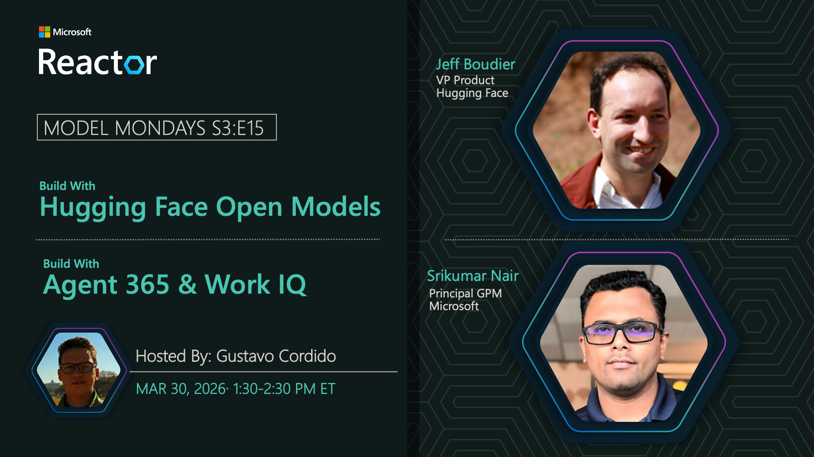

## Agent 365

**Date:** March 30, 2026  
**Season:** 3 | **Episode:** 15  
**Host:** [Korey Stegared-Pace](https://linkedin.com/in/koreyspace)

### News Highlights

1. [Agent 365 Launch](https://aka.ms/model-mondays) - Agents in the workplace
2. [Microsoft 365 Integration](https://aka.ms/model-mondays) - Seamless work integration
3. [Enterprise Security](https://aka.ms/model-mondays) - Secure agent deployment
4. [Managed Infrastructure](https://aka.ms/model-mondays) - Enterprise-grade platform
5. [Workplace Transformation](https://aka.ms/model-mondays) - AI-powered productivity

### Tech Spotlight: Agent 365

Agents are transforming the way we work – so how can we integrate them seamlessly into our work environments? Discover how Agent 365 extends infrastructure to support agents in a secure, managed way.

**Key Features:**
- Seamless Microsoft 365 integration
- Enterprise security and compliance
- Managed agent infrastructure
- Workplace-optimized agents
- Secure deployment and monitoring

**Speaker:** [Srikumar Nair](https://linkedin.com/in/srikumarknair)

_Srikumar is a Partner Product Manager at Microsoft, leading Agent 365 and Microsoft 365 AI agent integration initiatives. He focuses on enabling seamless agent integration into Microsoft 365 with secure, managed infrastructure._

**Resources:**
- [Agent 365 Documentation](https://aka.ms/model-mondays)
- [Deployment Guide](https://aka.ms/model-mondays)
- [Security Best Practices](https://aka.ms/model-mondays)

### Summary

Join Srikumar Nair as he explores Agent 365 and how it transforms workplace productivity by integrating agents into Microsoft 365 environments. Learn about secure deployment, managed infrastructure, and best practices for enterprise agent adoption.

**Related AMA:** [View AMA Discussion](../foundry-fridays/2026-04-03-s03-e15.md)
