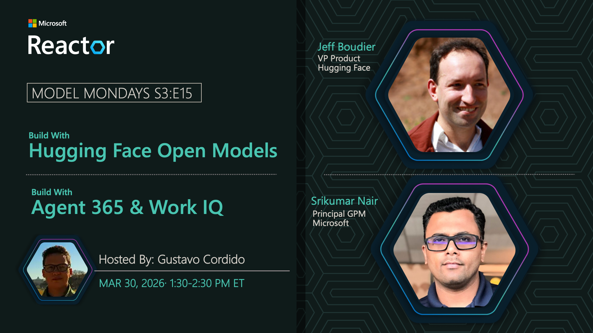
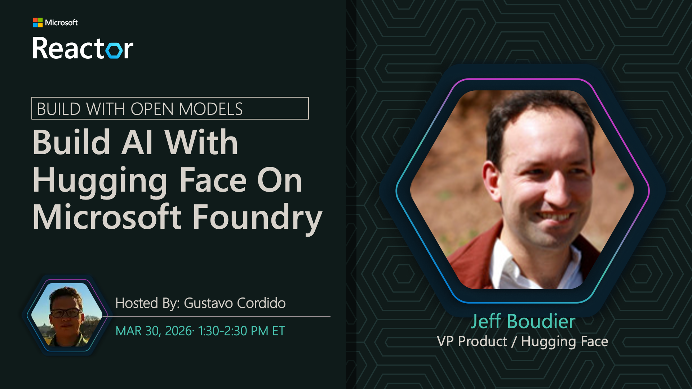
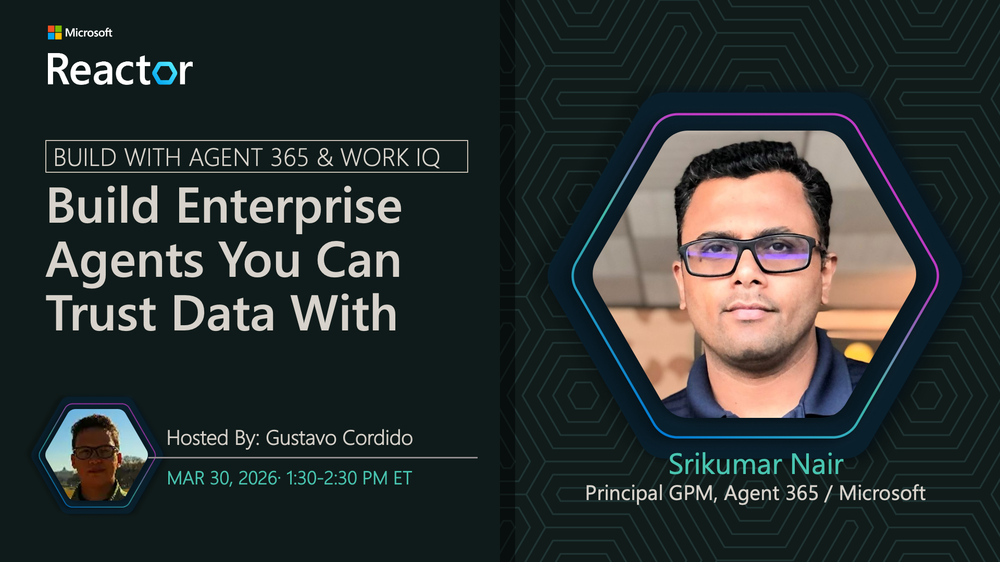

## Spotlight on: Hugging Face, Agent 365 & Work IQ

- **Date:** March 30, 2026
- **Season:** 3 | **Episode:** 15
- **Host:** [Gustavo Cordido](https://www.linkedin.com/in/gcordido/)

### News Highlights This Week

_Join the livestream to learn about top new model and platform updates from the previous week_.

### Partner Spotlight: Hugging Face

| | |
|:---:|:---|
| Topic | **How to build AI with Hugging Face in Microsoft Foundry** |
| Abstract | With open source models, you can build your own AI applications for text, audio, images and more. How do you deploy them securely within your enterprise environment? Join Jeff Boudier from Hugging Face to learn about the latest and greatest open models, and how to easily deploy them in your Azure account with Microsoft Foundry.  |
| Speaker Bio | _Jeff Boudier is the Head of Product + Growth at Hugging Face, an open platform and community for AI builders._|
| | |

 

### Tech Spotlight: Agent 365 and Work IQ

| | |
|:---:|:---|
| Topic | **Building enterprise agents that you can trust your data with** |
| Abstract | Agents are easy to build but hard to govern, scale, and trust in real work. In this conversation, we unpack why Agent 365 as a control plane is the critical missing layer, and how Work IQ MCP servers turn productivity systems into efficient, fully governable tools for agents. Learn how moving from prompt‑level hacks to platform‑level design unlocks real productivity gains, all of this without sacrificing control. If you care about agents that actually get work done at enterprise scale, this is the paradigm shift that matters. |
| Speaker Bio | _Srikumar is a Partner Product Manager at Microsoft, leading Agent 365 and Microsoft 365 AI agent integration initiatives._|
| | |

**Resources:**
- [Agent 365 Documentation](https://aka.ms/model-mondays)
- [Deployment Guide](https://aka.ms/model-mondays)
- [Security Best Practices](https://aka.ms/model-mondays)

 

### Foundry Friday AMA

Don't forget to join us for #FoundryFridays - an AMA on the [Microsoft Foundry Discord](https://aka.ms/model-mondays/discord) - to ask questions and share your feedback with the subject matter experts featured on this show.

**Learn More:** [Foundry Friday AMA](../foundry-fridays/2026-04-03-s03-e15.md)
