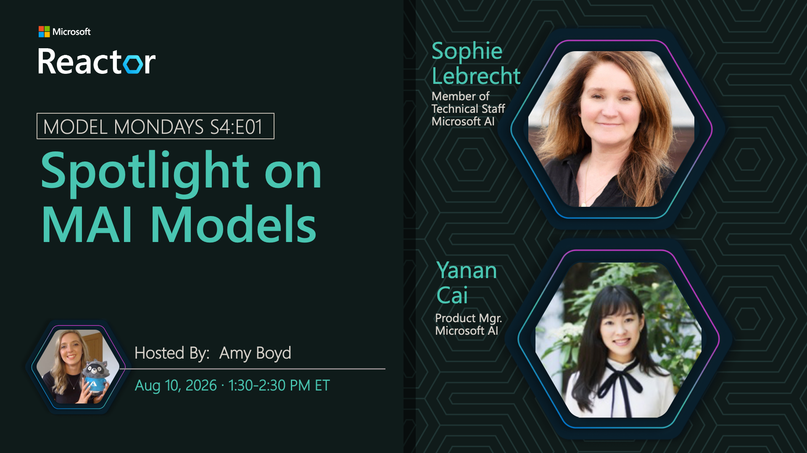

# Spotlight on MAI Models

**Date:** August 10, 2026  
**Season:** 4 | **Episode:** 1  
**Host:** Amy Boyd

**Guests:**
- Sophie Lebrecht — Member of Technical Staff, Microsoft AI
- Yanan Cai — Product Manager, Microsoft AI

## Overview

At Microsoft Build, we announced a family of seven new models developed in-house at Microsoft AI. These models form a new multimodal ecosystem designed to work across a variety of real-world tasks - with models to support image, voice, transcription, coding, and reasoning. Join us as we talk to the Microsoft AI models team about what's new in the MAI family, how this works under the hood, and what we can do to use them more effectively for building AI agents.
