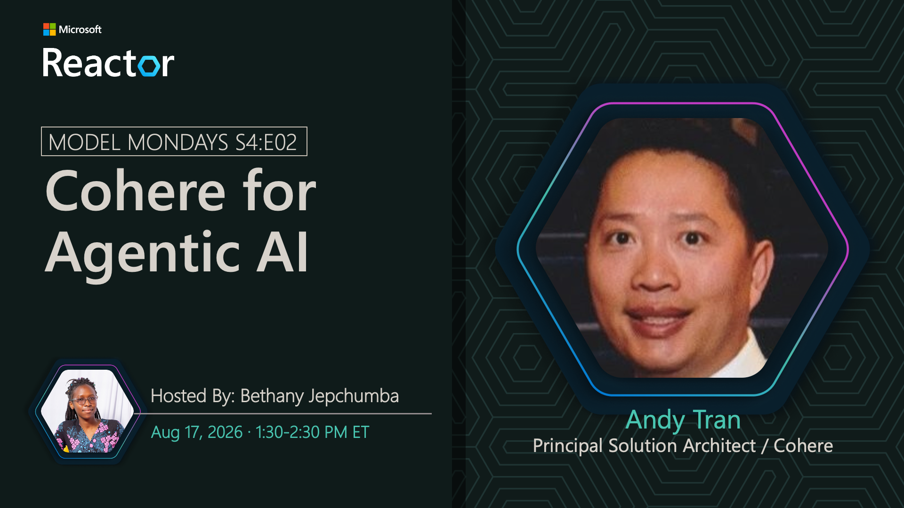

# Cohere for Agentic AI

**Date:** August 17, 2026 
**Season:** 4 | **Episode:** 2 
**Host:** Bethany Jepchumba

**Guests:**
- Andy Tran — Principal Solution Architect, Cohere

## Overview

In this episode of Model Mondays, we’ll go under the hood of the latest Cohere models in Microsoft Foundry: Command A+ for agentic, multilingual, and reasoning-heavy workloads; Embed v4 for semantic search and retrieval; and Rerank v4 for improving grounded answer quality by reordering retrieved context before generation. We’ll explore how these models fit together in an enterprise RAG pipeline, how developers can evaluate retrieval quality and model behavior, and leverage Cohere models to build more accurate, secure, and context-aware AI agents.
