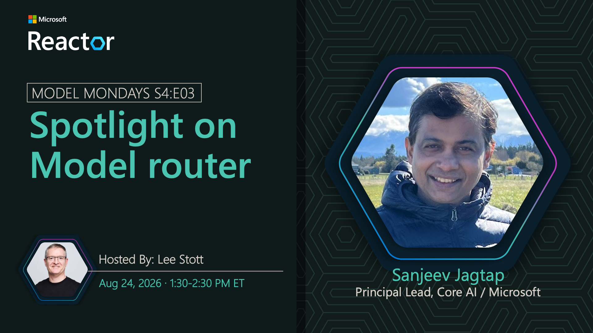

# Spotlight on Model Router

**Date:** August 24, 2026 
**Season:** 4 | **Episode:** 3 
**Host:** Lee Stott

**Guests:**
- Sanjeev Jagtap — Principal Lead, Core AI, Microsoft
- Lee Stott — Senior Cloud Advocate, Microsoft
- Nitya Narasimhan — Senior Cloud Advocate, Microsoft
- Sharmila Chockalingam — Director, AI Product Marketing, Microsoft

## Overview

AI agents rarely rely on a single model to solve every task. In this episode of Model Mondays, we'll explore how model router helps developers apply a hill-climbing approach to agent development by continuously finding better models for different steps in a workflow. Learn how to evaluate models, compare performance across providers and model families, and dynamically route requests to the model best suited for each task. Through discussions and demos, we'll show how model router helps agents improve quality, efficiency, and cost by treating model selection as an ongoing optimization process rather than a one-time decision.

## Replay

[Watch the replay on YouTube](https://www.youtube.com/watch?v=od_WTpE2nH4)

The spotlight covers what model router is, how prompt routing works, the updated model list, automatic failover, policy enforcement, and benchmarking, then introduces hill climbing as a way to keep improving model selection. A workshop segment asks whether routing actually saves money, the Model Releases segment builds an optimization playbook, and the stream closes with weekly Microsoft Foundry highlights.

**Chapters:** reproduced from the YouTube description for convenience.

- [0:00](https://www.youtube.com/watch?v=od_WTpE2nH4) Introduction and Code of Conduct
- [0:59](https://www.youtube.com/watch?v=od_WTpE2nH4&t=59s) Welcome to Model Mondays
- [2:19](https://www.youtube.com/watch?v=od_WTpE2nH4&t=139s) What's new in Model Router
- [3:06](https://www.youtube.com/watch?v=od_WTpE2nH4&t=186s) What is Model Router?
- [7:41](https://www.youtube.com/watch?v=od_WTpE2nH4&t=461s) Reducing latency and improving response precision
- [11:57](https://www.youtube.com/watch?v=od_WTpE2nH4&t=717s) How prompt routing works
- [17:58](https://www.youtube.com/watch?v=od_WTpE2nH4&t=1078s) Updated list of available models
- [20:45](https://www.youtube.com/watch?v=od_WTpE2nH4&t=1245s) Automatic model failover
- [24:14](https://www.youtube.com/watch?v=od_WTpE2nH4&t=1454s) Policy enforcement in the routing stack
- [25:44](https://www.youtube.com/watch?v=od_WTpE2nH4&t=1544s) Benchmarking the router
- [27:54](https://www.youtube.com/watch?v=od_WTpE2nH4&t=1674s) Multiple agents, one model deployment
- [30:11](https://www.youtube.com/watch?v=od_WTpE2nH4&t=1811s) What is hill climbing?
- [32:27](https://www.youtube.com/watch?v=od_WTpE2nH4&t=1947s) Hill climbing with the model router
- [36:19](https://www.youtube.com/watch?v=od_WTpE2nH4&t=2179s) Workshop: Can routing save money?
- [54:49](https://www.youtube.com/watch?v=od_WTpE2nH4&t=3289s) Model Releases: How to build my optimization
- [1:04:24](https://www.youtube.com/watch?v=od_WTpE2nH4&t=3864s) Weekly highlights in Microsoft Foundry
- [1:09:32](https://www.youtube.com/watch?v=od_WTpE2nH4&t=4172s) What's next week on Model Mondays

## Slides

[Download the slides (PDF)](../assets/model-mondays/S04-E03-Model-Router.pdf)

The deck opens with how model router works under the hood: a compact classifier analyzes each prompt and dispatches it to a best-fit model, with Cost, Balanced, and Quality routing modes that adjust how far the router may trade quality for savings. It then covers the controls teams need in production — model subsets as a compliance gate, automatic failover across the approved pool, and Azure Policy enforcement that cascades from the router to every model in the subset.

The middle segment applies hill climbing to model selection, framing each routing decision as an instrumented step in a measurement loop, and walks through a Microsoft Reactor lab that deploys a fixed baseline alongside two router configurations, runs a smoke test over synthetic support cases, and slices results by task type and risk instead of trusting an overall average. The closing segments demo a policy-compliant travel concierge, showing how to replace a single frontier model with the router and then decompose the workload across right-sized models, followed by recent Microsoft Foundry highlights.
