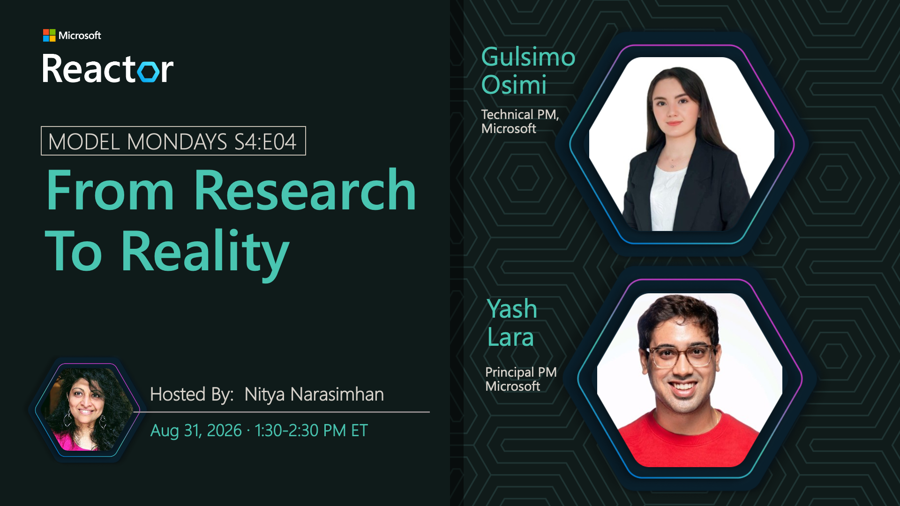

# From Research to Reality

**Date:** August 31, 2026  
**Season:** 4 | **Episode:** 4  
**Host:** Nitya Narasimhan

**Guests:**
- Gulsimo Osimi — Technical Program Manager, Microsoft
- Yash Lara — Principal Product Manager, Microsoft

## Overview

Foundry Labs is where developers can explore the latest AI innovations emerging from Microsoft Research and Microsoft AI. In this episode, we'll look at how experimental models and research projects make their way from breakthrough ideas to real-world impact. We'll then take a closer look at one of these experiments, Fara1.5 - a family of small but powerful computer-use models designed for browser automation that can navigate websites, fill forms, and complete multi-step tasks, while setting new state-of-the-art performance among models in its class. Finally, this week Developer Corner will showcase how to build with Foundry-hosted models within the GitHub copilot App using Foundry Canvas.
