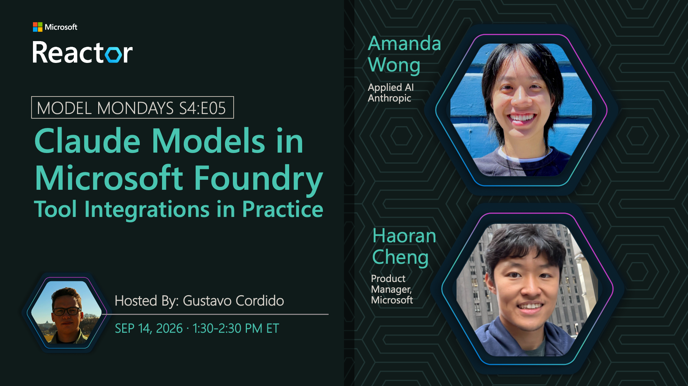

# Claude Models in Microsoft Foundry: Tool Integrations in Practice

**Date:** September 14, 2026 
**Season:** 4 | **Episode:** 5 
**Host:** Gustavo Cordido

**Guests:**
- Amanda Wong — Applied AI, Anthropic
- Haoran Cheng — Product Manager, Microsoft

## Overview

A single well-crafted prompt only gets an agent so far. This session shows how to take agents further with tool integrations available for Claude in Microsoft Foundry hosted on Azure. We'll build workflows from scratch, covering the setup choices that matter most and how to get them right from the start
