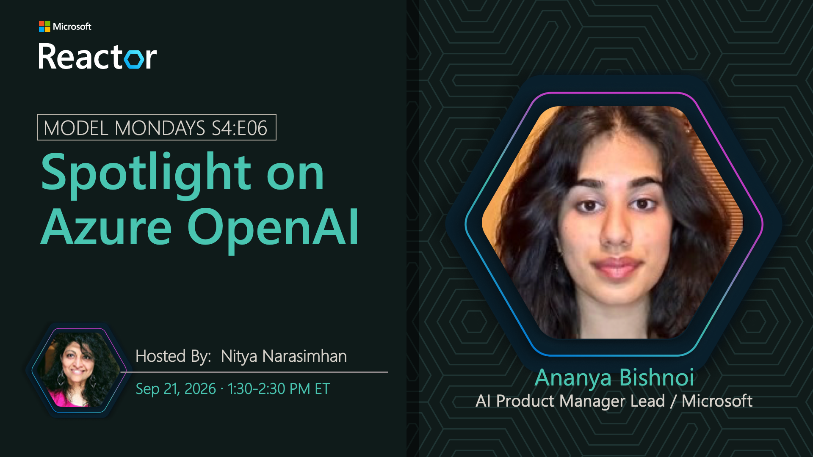

# Spotlight on Azure OpenAI

**Date:** September 21, 2026 
**Season:** 4 | **Episode:** 6 
**Host:** Nitya Narasimhan

**Guests:**
- Ananya Bishnoi — AI Product Manager Lead, Microsoft

## Overview

Azure OpenAI provides a broad family of models for generation, reasoning, coding, multimodal, and real-time experiences, allowing developers to select the right capability for each part of an application. Join us as we explore these models in Microsoft Foundry and see how they can be combined with grounding, tools, and evaluation to build effective AI agents.
