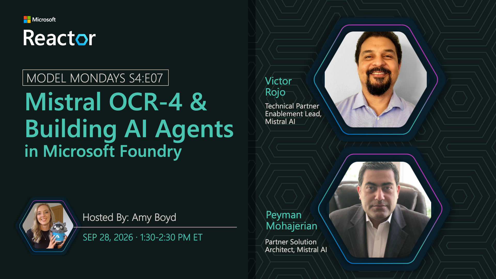

# Mistral OCR-4 & Building AI Agents in Microsoft Foundry

**Date:** September 28, 2026  
**Season:** 4 | **Episode:** 7  
**Host:** Amy Boyd

**Guests:**
- Victor Rojo — Technical Partner Enablement Lead, Mistral AI
- Peyman Mohajerian — Partner Solution Architect, Mistral AI

## Overview

Mistral models offer developers a versatile family of models for reasoning, coding, multilingual, and multimodal workloads, with options suited to different requirements for capability, speed, and efficiency. Join us as we explore the Mistral OCR-4 model in Microsoft Foundry and see how Mistral models can support practical agent workflows.
