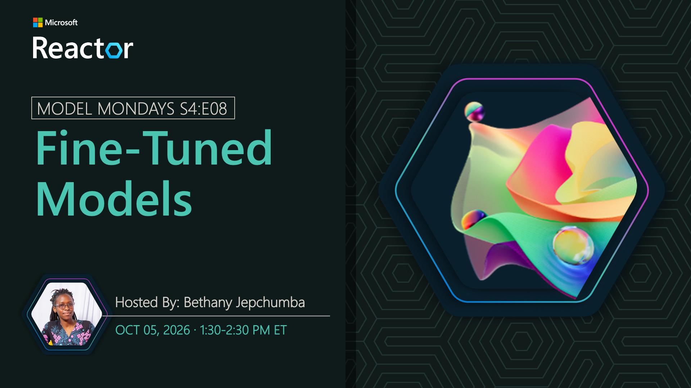

# Fine-Tuned Models

**Date:** October 5, 2026 
**Season:** 4 | **Episode:** 8 
**Host:** Bethany Jepchumba

## Overview

Fine-tuning adapts a model to the language, examples, and behaviors of a specific task, helping developers improve quality, reduce prompt complexity, and right-size performance and cost. Join us as we explore the latest fine-tuning capabilities in Microsoft Foundry and see how customized models can strengthen specialized AI agent experiences.
