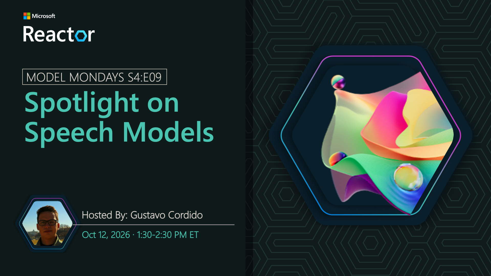

# Spotlight on Speech Models

**Date:** October 12, 2026  
**Season:** 4 | **Episode:** 9  
**Host:** Gustavo Cordido

## Overview

Speech models enable applications to understand and generate spoken language, supporting experiences such as transcription, voice interaction, and accessible conversational interfaces. Join us as we explore speech capabilities in Microsoft Foundry and see how they can be integrated into responsive, voice-enabled AI agents.
