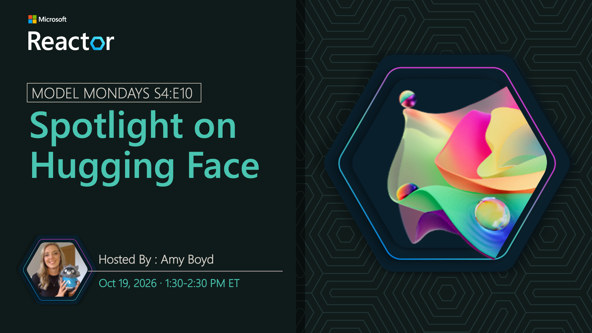

# Spotlight on Hugging Face

**Date:** October 19, 2026  
**Season:** 4 | **Episode:** 10  
**Host:** Amy Boyd

## Overview

Hugging Face expands the range of open models developers can discover, while Managed Compute provides the infrastructure needed to deploy and run selected models for real-time inference. Join us as we explore this workflow in Microsoft Foundry and see how an open model can move from the catalog into a working AI agent.
