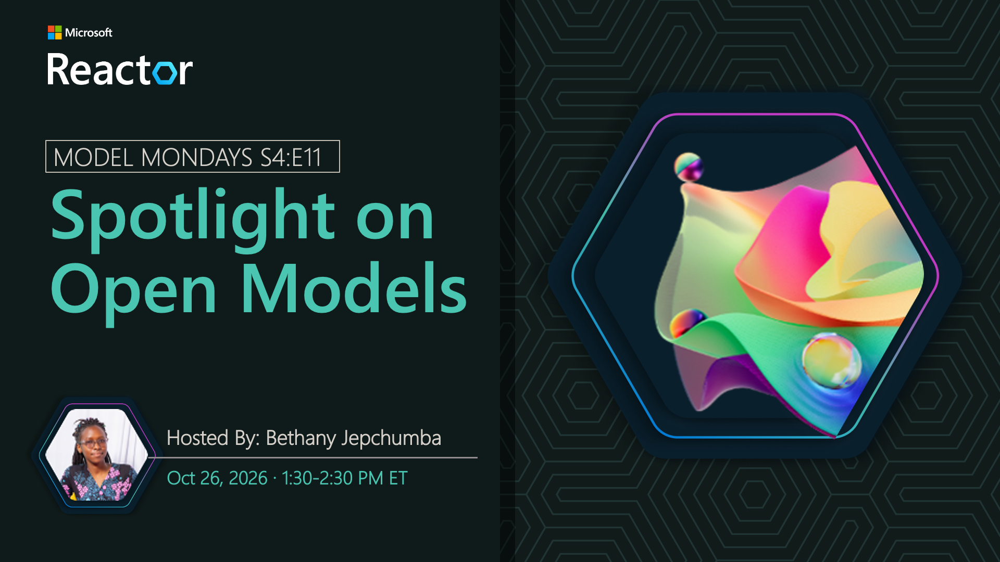

# Spotlight on Open Models

**Date:** October 26, 2026 
**Season:** 4 | **Episode:** 11 
**Host:** Bethany Jepchumba

## Overview

Open models such as Kimi-K and Inkling give developers additional choices for reasoning, coding, and agentic workloads, with different tradeoffs in capability, flexibility, and deployment. Join us as we explore these models in Microsoft Foundry and see how evaluation can help identify the right open model for an AI agent.
