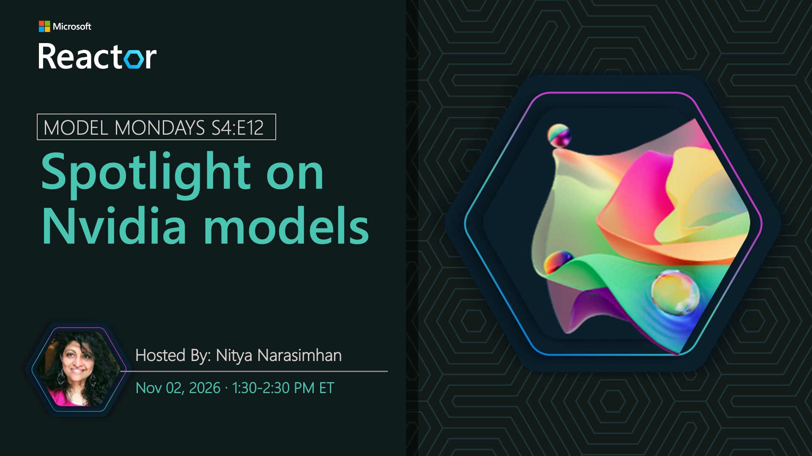

# Spotlight on NVIDIA Models

**Date:** November 2, 2026 
**Season:** 4 | **Episode:** 12 
**Host:** Nitya Narasimhan

## Overview

NVIDIA models give developers options for building and deploying AI workloads that require strong reasoning, generation, and accelerated inference across a range of application scenarios. Join us as we explore NVIDIA models in Microsoft Foundry and see how they can be evaluated and used to build effective AI agents.
