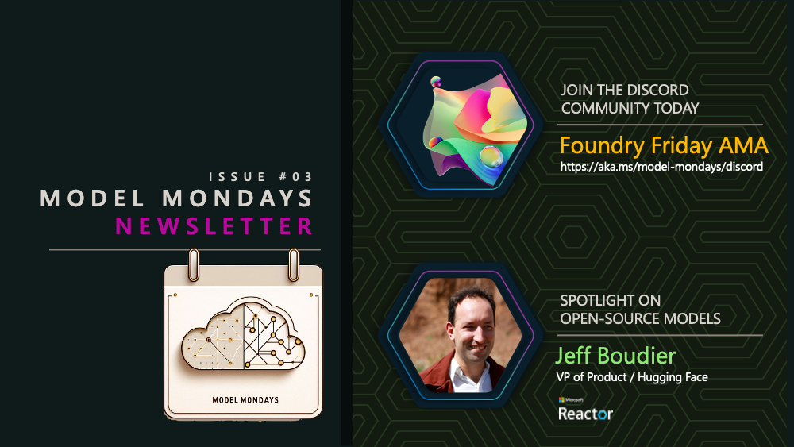
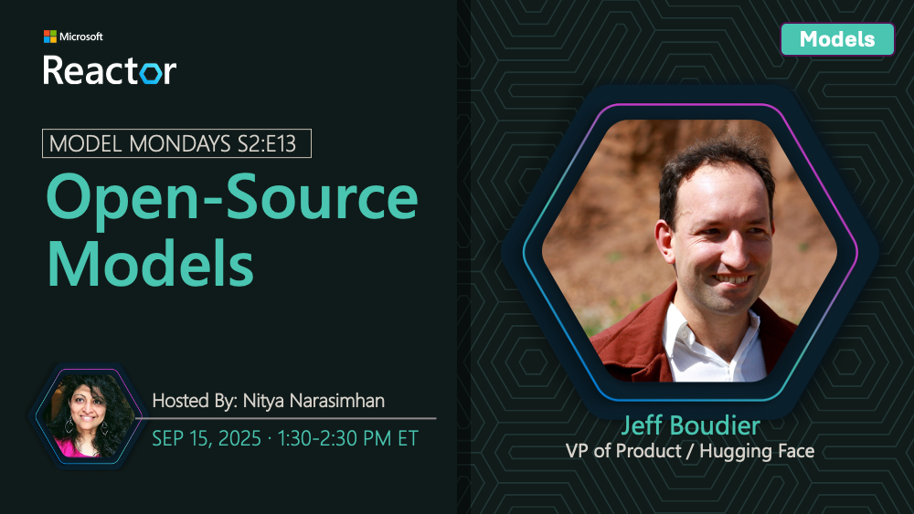

# Issue #03 | Open-Source Models & Season 3 Encore!

## The Newsletter Reboot

I'm back! After a 2-month hiatus, I decided to restart the newsletter with a more flexible schedule and a more Azure AI specific focus. The reason is simple. In the upcoming weeks, I'll be focused on content creation & session delivery for:

1. The [Microsoft AI Tour](https://aitour.microsoft.com) global event series
2. The [Microsoft Ignite](https://ignite.microsoft.com) 2025 conference
3. The [Models For Beginnners](https://aka.ms/models-for-beginners/github) curriculum 
4. The [Model Mondays](https://aka.ms/model-mondays) season 3 launch

I can't wait to share the latest news, tools, technologies and learning resources that our advocacy and product teams are working on - but instead of a fixed schedule, I'll focus on more flexible updates that reflect the pace of evolution.

## Spotlight On: Open-Source Models

This weeks marks the [21st episode of Model Mondays](https://aka.ms/model-mondays) and the finale for [Season 2](https://aka.ms/model-mondays/playlist) which kicked off in June 2025. _Planning is already underway for a new season 3 to kick off in December - but more on that later_.

In today's episode we talk to Jeff Boudier (VP of Product at Hugging Face) about the Hugging Face Collection on Azure AI Foundry - and how AI developers can get started exploring the 10K+ options to support a diversity of inference tasks from standard text generation to visual question answering and more. 

This is a _show, not tell_ segment with hands-on demos that answer questions like:

1. Where can I find Hugging Face models on Azure AI?
1. How do I get started using them?
1. How do I discover the right model for my task?
1. What are some interesting models I should explore?

The latter covers not just popular open-source models like the Qwen family, but also cutting edge models [from Microsoft Research](https://huggingface.co/microsoft) that you can begin exploring today!

1. [Watch the livestream](https://aka.ms/model-mondays/rsvp) at 1:30pm EST on Sep 15
1. [Join the AMA with Jeff](https://aka.ms/model-mondays/discord) at 1:30pm EST on Sep 19
1. [Explore more resources](https://aka.ms/model-mondays) on Model Mondays website

## Model Mondays Season 2: Recap

After our pilot season (Mar-May), we kicked off an extended season of 12 episodes (Jun-Sep) for Season 2 - this time with a spotlight focus on core tools & technologies. Each episode featured
- 5 mins Highlights - catch up on the week's announcements
- 15 min Spotlight - demo-driven deep dive into a key topic
- 15 min Customer Story - see real-world adoption of Azure AI

Visit [the website](https://github.com/microsoft/model-mondays?tab=readme-ov-file#season-2-jun-sep-2025) to get links to the replays, slides, transcripts and more - here's what we covered this season:

- **[S2:E01 - Advanced Reasoning](https://www.youtube.com/watch?v=ffxUEenM4B8)** - Marlene Mhangami explored advanced reasoning techniques with Deep Researcher built using DeepSeek R1 and LangChain.
- **[S2:E02 - Model Context Protocol](https://www.youtube.com/watch?v=cPS3cWRZTps)** - Den Delimarsky provided a deep dive into MCP specification and security considerations for extending AI model capabilities.
- **[S2:E03 - SLMs and Reasoning](https://www.youtube.com/watch?v=VLQKZq8L9Uk)** - Mojan Javaheripi covered Phi-4 reasoning models designed for resource-constrained devices in the agentic era.
- **[S2:E04 - AI & Dev Experience](https://www.youtube.com/watch?v=tNiFbf3XP6k)** - Leo Yao showcased AI Toolkit and Azure AI Foundry VS Code extensions for streamlined AI development workflows.
- **[S2:E05 - Fine-Tuning & Distillation](https://www.youtube.com/watch?v=VSNGzBB20aw)** - Dave Voutila explored model customization techniques including fine-tuning Azure OpenAI models and distillation best practices.
- **[S2:E06 - Research & Innovation](https://www.youtube.com/watch?v=chjpVSrk3jA)** - SeokJin Han and Saumil Shrivastava featured Azure AI Foundry Labs projects including MCP Server and Magentic-UI.
- **[S2:E07 - AI-Assisted Azure Dev](https://www.youtube.com/watch?v=mSrg1uP136g)** - Sandeep Sen covered Azure MCP server and GitHub Copilot Extension for Azure to enhance development workflows.
- **[S2:E08 - On-Device & Local AI](https://www.youtube.com/watch?v=ILBDDCJ0d9g)** - Maanav Dalal explored Foundry Local solutions built on ONNX Runtime for edge computing needs.
- **[S2:E09 - AI Agents](https://www.youtube.com/watch?v=fjSxraAmGMI)** - Mona Whalin introduced the Azure AI Foundry Agent Catalog and open-source samples for accelerating agent development.
- **[S2:E10 - Document Processing](https://www.youtube.com/watch?v=tqOecUt_wCc)** - Featured Mistral Doc AI for multimodal, multilingual document processing from European AI innovator Mistral AI.
- **[S2:E11 - AI Foundry Speech Playground](https://www.youtube.com/watch?v=Rr4iSCyE7IY)** - Utkarsh Maheswari demonstrated natural language and speech capabilities including text-to-speech and speech-to-text.
- **[S2:E12 - Models & Observability](https://www.youtube.com/watch?v=gEH2ACNf5b0)** - Han Che covered evaluations, red-teaming, and end-to-end observability in Azure AI Foundry for trustworthy AI.
- **[S2:E13 - Open-Source Models](https://www.youtube.com/watch?v=BANtEq-0FsE)** - Season finale featuring Jeff Boudier (VP of Product, Hugging Face) exploring the 10K+ Hugging Face Collection on Azure AI Foundry.

### The Customer Stories

Learning how to use models and tools does not always give you insights into how they can transform or impact real-world usage. This is where the customer stories segment really connected with me. Check out all the customer stories below - sometimes, it's the human connection that really resonated the most. For example - the Xander Glasses team showed how real-time AI captioning was not just a convenience, but a necessity for individuals suffering hearing loss or trauma - allowing them to convert "sound to sight" at their own pace.

- **[Capacity](https://capacity.com)** - Steve Frederickson and Zachary Meierhoffer showcased how their Answer Engine uses Azure AI Foundry models to unlock organizational knowledge insights.
- **[SightMachine](https://sightmachine.com)** - Kurt DeMaagd (Chief AI Officer) demonstrated how Filler AI streamlines manufacturing floor operations using Azure AI Foundry models.
- **[Xander Glasses](https://www.xanderglasses.com)** - Marilyn Morgan Westner and Alex Westner shared how their platform helps assistive technology experiences for 
- **[Atomicwork](https://www.atomicwork.com)** - Sukrit Chatterjee explained how they design integrated AI systems that learn from their environment and adapt to task context.
- **[Oracle Health](https://www.oracle.com/health/)** - Sri Gadde demonstrated how fine-tuning improves quality and reduces latency in clinical AI settings.
- **[Healow](https://www.healow.com)** - Sidd Shah showed how multimodal AI enhances healthcare experiences in their patient engagement platform.
- **[Saifr](https://www.saifr.com)** - David Johnston and Brett Trainor presented how their AI solutions help financial service developers create compliant applications and agents.
- **[DraftWise](https://www.draftwise.com)** - James Ding (CEO) revealed how AI models are revolutionizing legal contract drafting, review, and negotiation.

## What's Next: 

### 1. Foundry Friday AMAs Continues

Model Mondays Season 3 will launch in December. In the meantime, keep an eye on our [Foundry Friday AMA Schedule](https://aka.ms/model-mondays/forum) to continue conversations and demo-drive discussions with community and industry experts! And keep an eye out for our _Encore_ posts where we revisit Season 2 episodes and ask _What's New?_.

## 2. Models For Beginners

Model Mondays helps grow awareness of AI model ecosystem news and updates. But how can you get started on your AI engineering journey into model development? Based on the popular **For Beginners** series, we're developing a _Model For Beginners_ curriculum with four stages:

1. Model Fundamentals - meet the models & learn their capabilities
2. Model Selection - pick the right model for the task at hand
3. Model Customization - give them context & training to do the job!
4. Model Observability - watch their performance & help them improve

We plan to launch the series in October 2025 - with _weekly drops_ to help you learn at a steady pace. And you won't have to do it alone! [Join our Azure AI Discord](https://aka.ms/model-mondays/discord) and watch the _#model-mondays_ channel for more updates!

## Until Next Time!

[Subscribe to this newsletter](https://aka.ms/model-mondays/newsletter) to get updates on new Model Mondays episodes, Models For Beginners lessons, and Microsoft announcements on new AI models, tools & technologies!

**Let's Build Our Model IQ**