# Model Mondays: Season 3

> [!NOTE]
> **🚧 Work in Progress** — This page is currently being updated with Season 3 details. Information may be incomplete or subject to change.

Season 3 kicks off in December 2025 with 16 episodes focused on Microsoft Foundry capabilities, agentic AI development, and cutting-edge tools and technologies. Each episode features tech spotlights and demos from Microsoft experts.

  

## S3:E01 · Smart Models / Model Router

> Every AI development journey begins with model choice. But what if you had a smart model that routed your request to the best model for the job? Join us as we talk to Sanjeev Jagtap about the Model Router – a chat model that optimizes model choice for cost-effective use in Azure AI!

 - 1️⃣ | [Register For The Livestream](https://aka.ms/model-mondays/rsvp) - Dec 01, 2025
 - 2️⃣ | [Register For The AMA](https://aka.ms/model-mondays/chat) - TBD
 - 3️⃣ | [Ask Questions & View Recaps](https://aka.ms/model-mondays/forum) - Discussion Forum
 - 4️⃣ | [Download Slides](https://aka.ms/model-mondays/slides) - Speakerdeck PDF

**Host:** Nitya  
**Speaker:** Sanjeev Jagtap, PMM, Azure AI

### AMA Session

---

 

## S3:E02 · AI Red Teaming

> Assessing risks to your models and agentic AI apps is critical to building trustworthy AI. Join us as we talk to Minsoo Thigpen about the AI Red Teaming Agent on Microsoft Foundry.

 - 1️⃣ | [Register For The Livestream](https://aka.ms/model-mondays/rsvp) - TBD
 - 2️⃣ | [Register For The AMA](https://aka.ms/model-mondays/chat) - TBD
 - 3️⃣ | [Ask Questions & View Recaps](https://aka.ms/model-mondays/forum) - Discussion Forum
 - 4️⃣ | [Download Slides](https://aka.ms/model-mondays/slides) - Speakerdeck PDF

**Host:** Nitya  
**Speaker:** Minsoo Thigpen

**Resources:**
- [Learn More](https://aka.ms/model-mondays)
- [Try the Workshop](https://aka.ms/model-mondays)

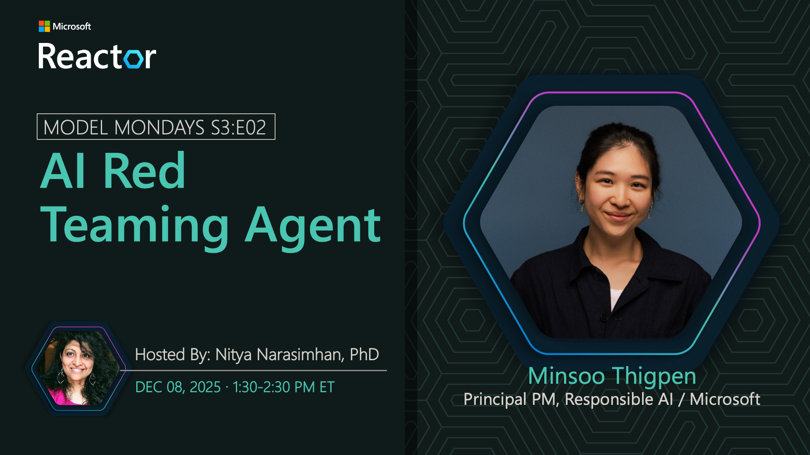

---

 

## S3:E03 · Foundry Local

> Foundry Local provides on-device inference with data privacy, bringing the power of Azure AI with multi-language SDKs to local environments. Join us as we talk to Maanav Dalal about the latest updates to Foundry Local.

 - 1️⃣ | [Register For The Livestream](https://aka.ms/model-mondays/rsvp) - TBD
 - 2️⃣ | [Register For The AMA](https://aka.ms/model-mondays/chat) - TBD
 - 3️⃣ | [Ask Questions & View Recaps](https://aka.ms/model-mondays/forum) - Discussion Forum
 - 4️⃣ | [Download Slides](https://aka.ms/model-mondays/slides) - Speakerdeck PDF

**Host:** Lee  
**Speaker:** Maanav Dalal

**Resources:**
- [Learn More](https://aka.ms/model-mondays)
- [Visit The Website](https://aka.ms/model-mondays)

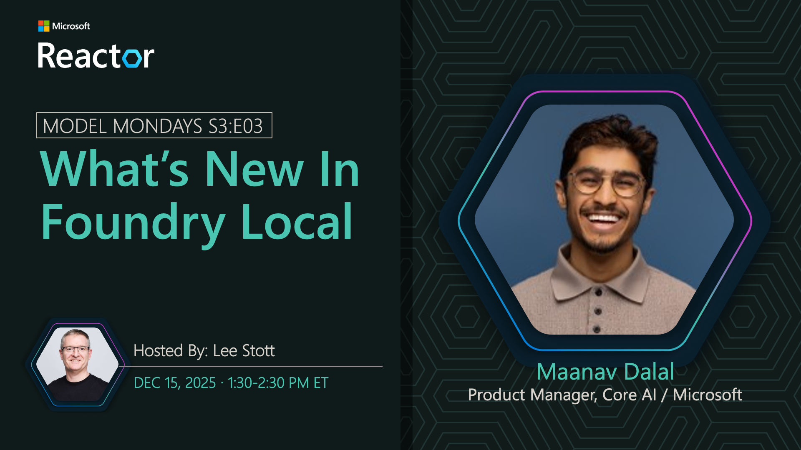

---

 

## S3:E04 · Microsoft Agent Framework

> Want to build scalable AI solutions with multi-agent orchestration on Microsoft Foundry? Join us as we talk to experts on the features and usage of Microsoft Agent Framework.

 - 1️⃣ | [Register For The Livestream](https://aka.ms/model-mondays/rsvp) - TBD
 - 2️⃣ | [Register For The AMA](https://aka.ms/model-mondays/chat) - TBD
 - 3️⃣ | [Ask Questions & View Recaps](https://aka.ms/model-mondays/forum) - Discussion Forum
 - 4️⃣ | [Download Slides](https://aka.ms/model-mondays/slides) - Speakerdeck PDF

**Host:** Korey  
**Speaker:** Shawn Henry

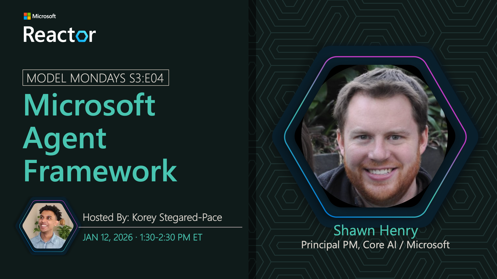

---

 

## S3:E05 · Responses API

> The Responses API is a stateful API from OpenAI that unifies the chat completion and assistants API capabilities in one experience to streamline your agent creation workflow in Microsoft Foundry. Join us as we talk to Guy Gregory about using this technology and why it matters.

 - 1️⃣ | [Register For The Livestream](https://aka.ms/model-mondays/rsvp) - TBD
 - 2️⃣ | [Register For The AMA](https://aka.ms/model-mondays/chat) - TBD
 - 3️⃣ | [Ask Questions & View Recaps](https://aka.ms/model-mondays/forum) - Discussion Forum
 - 4️⃣ | [Download Slides](https://aka.ms/model-mondays/slides) - Speakerdeck PDF

**Host:** Nitya  
**Speaker:** Guy Gregory

---

 

## S3:E06 · Fine-Tuning & Responses API (Double Header)

> Join us for this special double-header tech spotlight where we cover two key topics for agentic AI development.
>
> **First**, Dave Voutila joins us to talk about Fine Tuning in Microsoft Foundry. Learn about the latest features and tools to simplify the developer experience for model customization.
>
> **Next**, Guy Gregory joins us for a deep dive into the Responses API. Learn how it unifies the experience across prior chat completion and assistant API capabilities to streamline agent creation in Microsoft Foundry.

 - 1️⃣ | [Register For The Livestream](https://aka.ms/model-mondays/rsvp) - TBD
 - 2️⃣ | [Register For The AMA](https://aka.ms/model-mondays/chat) - TBD
 - 3️⃣ | [Ask Questions & View Recaps](https://aka.ms/model-mondays/forum) - Discussion Forum
 - 4️⃣ | [Download Slides](https://aka.ms/model-mondays/slides) - Speakerdeck PDF

**Host:** Bethany  
**Speakers:** Dave Voutila, Guy Gregory

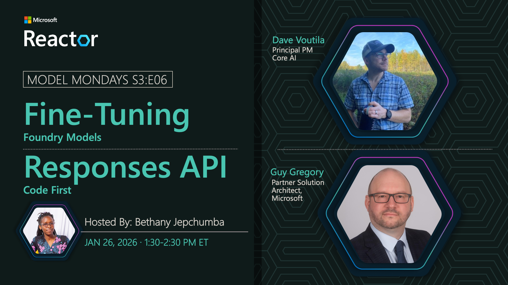

### AMA Session

---

 

## S3:E07 · Synthetic Data Generation

> Your model development is only as good as the evaluation and fine-tuning datasets you use! But finding high-quality, safe and diverse data is a challenge. Join us as we talk to William Liang about Synthetic Data Generation capabilities in Microsoft Foundry.

 - 1️⃣ | [Register For The Livestream](https://aka.ms/model-mondays/rsvp) - TBD
 - 2️⃣ | [Register For The AMA](https://aka.ms/model-mondays/chat) - TBD
 - 3️⃣ | [Ask Questions & View Recaps](https://aka.ms/model-mondays/forum) - Discussion Forum
 - 4️⃣ | [Download Slides](https://aka.ms/model-mondays/slides) - Speakerdeck PDF

**Host:** Bethany  
**Speaker:** William Liang

### AMA Session

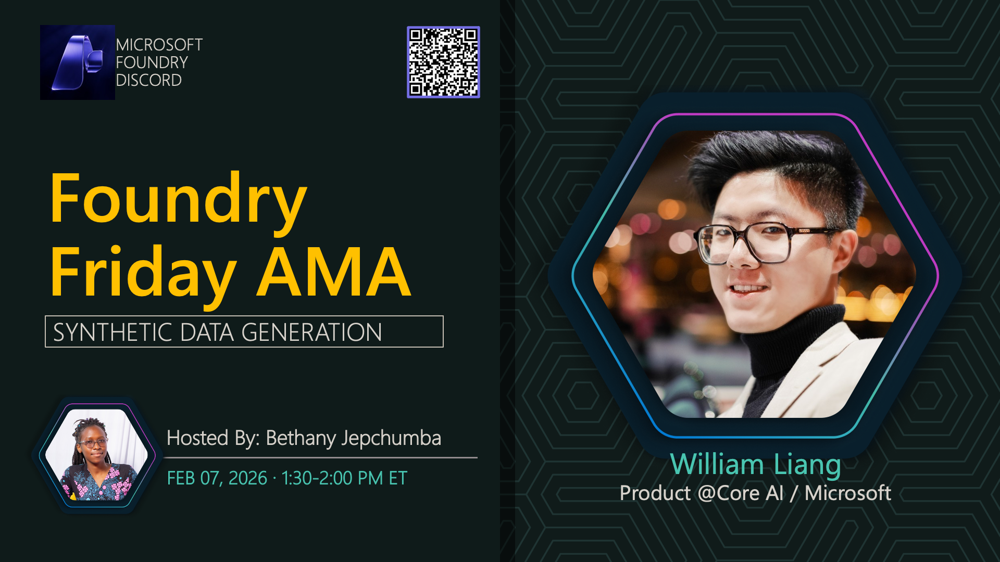

---

 

## S3:E08 · Foundry Portal & Next-Gen UI

> Building agentic AI solutions requires end-to-end workflows that take you from planning to prototype and production. Join us as we talk to Amir Zur about the Microsoft Foundry portal and the next-gen UI experience.

 - 1️⃣ | [Register For The Livestream](https://aka.ms/model-mondays/rsvp) - TBD
 - 2️⃣ | [Register For The AMA](https://aka.ms/model-mondays/chat) - TBD
 - 3️⃣ | [Ask Questions & View Recaps](https://aka.ms/model-mondays/forum) - Discussion Forum
 - 4️⃣ | [Download Slides](https://aka.ms/model-mondays/slides) - Speakerdeck PDF

**Host:** Nitya  
**Speaker:** Amir Zur

### AMA Session

---

 

## S3:E09 · Foundry Labs

> Want to experiment with cutting edge models and advanced tools from Microsoft Research? Join us as we talk to Yash Lara about Foundry Labs and projects like Magentic-UI, Fara, Phi-4 and more.

 - 1️⃣ | [Register For The Livestream](https://aka.ms/model-mondays/rsvp) - TBD (Feb 17 tentative)
 - 2️⃣ | [Register For The AMA](https://aka.ms/model-mondays/chat) - TBD
 - 3️⃣ | [Ask Questions & View Recaps](https://aka.ms/model-mondays/forum) - Discussion Forum
 - 4️⃣ | [Download Slides](https://aka.ms/model-mondays/slides) - Speakerdeck PDF

**Host:** Nitya  
**Speaker:** Yash Lara

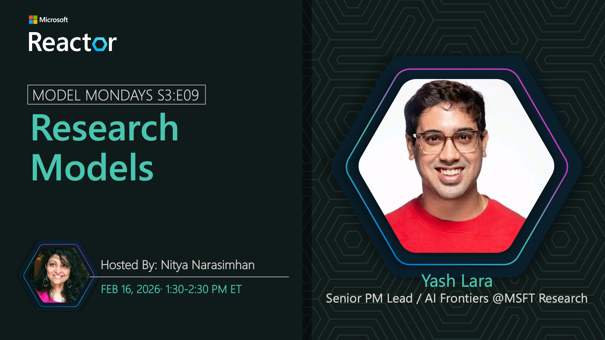

### AMA Session

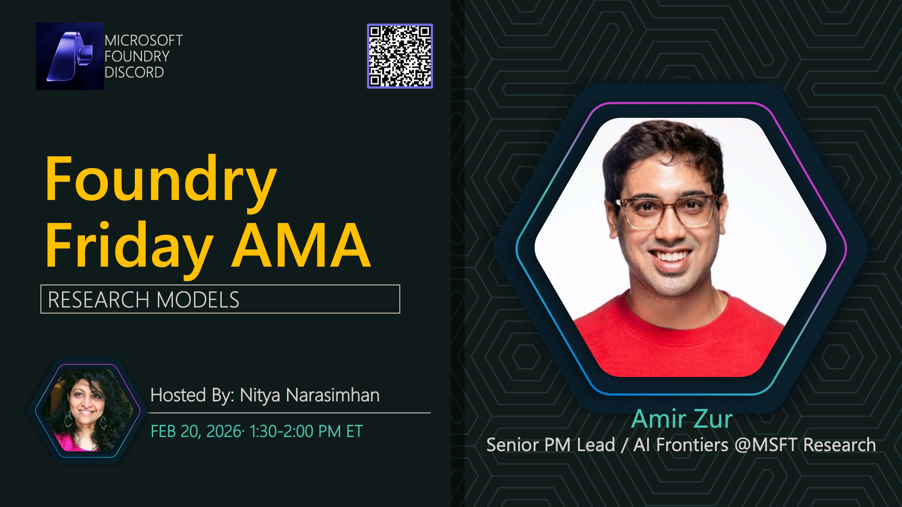

---

 

## S3:E10 · Foundry Agents

> Microsoft Foundry is your AI app and agent factory. Join us as we talk to Bala Venkataraman about Foundry Agents and the tools and services that provide a unified runtime taking you from planning to production!

 - 1️⃣ | [Register For The Livestream](https://aka.ms/model-mondays/rsvp) - TBD
 - 2️⃣ | [Register For The AMA](https://aka.ms/model-mondays/chat) - TBD
 - 3️⃣ | [Ask Questions & View Recaps](https://aka.ms/model-mondays/forum) - Discussion Forum
 - 4️⃣ | [Download Slides](https://aka.ms/model-mondays/slides) - Speakerdeck PDF

**Host:** Carlotta  
**Speaker:** Bala Venkataraman

### AMA Session

---

 

## S3:E11 · Foundry Control Plane

> Building agentic AI solutions at enterprise scale requires a unified management interface to observe every aspect of your AI fleet from plan to production. Join us as we talk to Sebastian Kohlmeier about the Foundry Control Plane for multi-agent fleet ops.

 - 1️⃣ | [Register For The Livestream](https://aka.ms/model-mondays/rsvp) - TBD
 - 2️⃣ | [Register For The AMA](https://aka.ms/model-mondays/chat) - TBD
 - 3️⃣ | [Ask Questions & View Recaps](https://aka.ms/model-mondays/forum) - Discussion Forum
 - 4️⃣ | [Download Slides](https://aka.ms/model-mondays/slides) - Speakerdeck PDF

**Host:** Nitya  
**Speaker:** Sebastian Kohlmeier

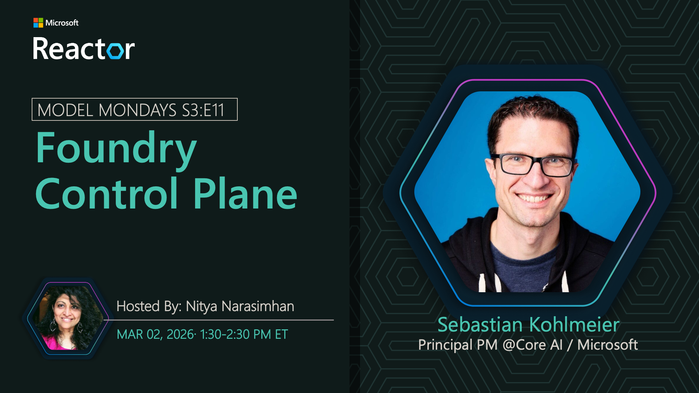

### AMA Session

---

 

## S3:E12 · AI Toolkit

> Want to plan, build, evaluate, customize, and deploy your agentic AI solutions right from your IDE? Join us as we talk to Rong Lu about the AI Toolkit and how it accelerates end-to-end developer experiences with Microsoft Foundry.

 - 1️⃣ | [Register For The Livestream](https://aka.ms/model-mondays/rsvp) - TBD
 - 2️⃣ | [Register For The AMA](https://aka.ms/model-mondays/chat) - TBD
 - 3️⃣ | [Ask Questions & View Recaps](https://aka.ms/model-mondays/forum) - Discussion Forum
 - 4️⃣ | [Download Slides](https://aka.ms/model-mondays/slides) - Speakerdeck PDF

**Host:** April  
**Speaker:** Rong Lu

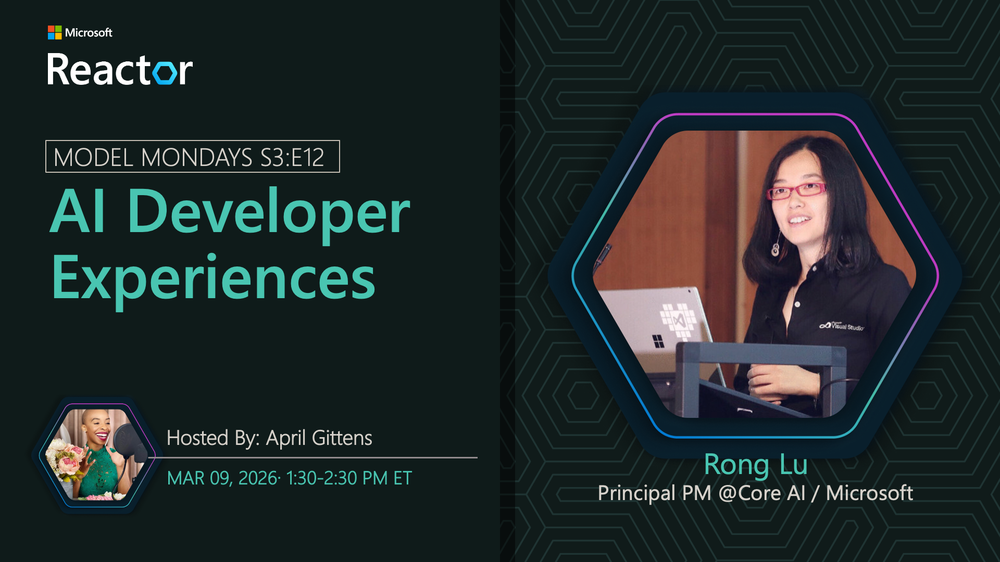

### AMA Session

---

 

## S3:E13 · Foundry IQ

> Foundry IQ is a unified knowledge layer powered by Azure AI Search, allowing agents to query and retrieve data for context engineering. Join us as we talk to Farzad Sunavala about how Foundry IQ works and why it matters.

 - 1️⃣ | [Register For The Livestream](https://aka.ms/model-mondays/rsvp) - TBD
 - 2️⃣ | [Register For The AMA](https://aka.ms/model-mondays/chat) - TBD
 - 3️⃣ | [Ask Questions & View Recaps](https://aka.ms/model-mondays/forum) - Discussion Forum
 - 4️⃣ | [Download Slides](https://aka.ms/model-mondays/slides) - Speakerdeck PDF

**Host:** Carlotta  
**Speaker:** Farzad Sunavala

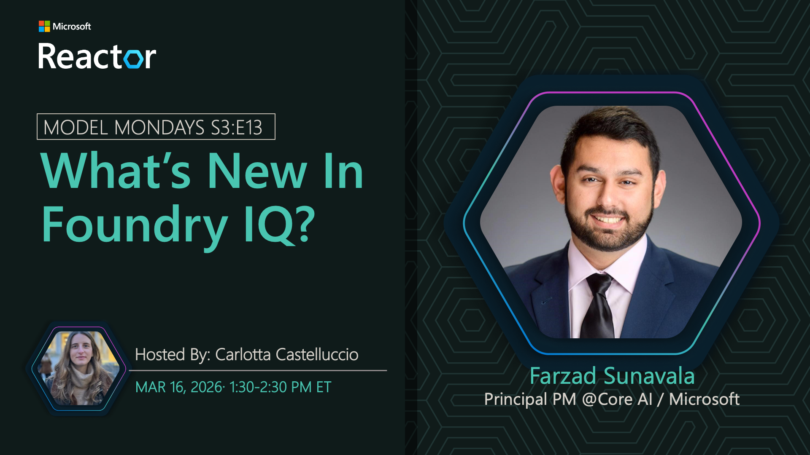

### AMA Session

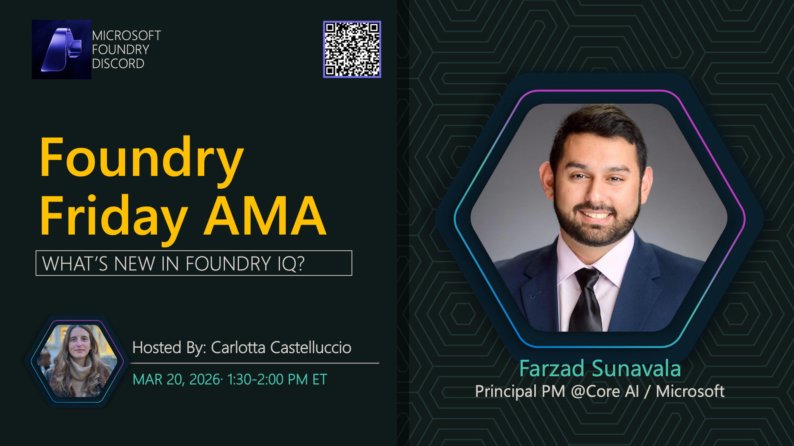

---

 

## S3:E14 · Foundry Tools & MCP

> The Foundry Tools provide a central hub for agents to discover and integrate tools (MCP Servers) to extend their capabilities. Join us as we talk to SeokJin Han about the new Foundry MCP Server and see Foundry Tools in action!

 - 1️⃣ | [Register For The Livestream](https://aka.ms/model-mondays/rsvp) - TBD
 - 2️⃣ | [Register For The AMA](https://aka.ms/model-mondays/chat) - TBD
 - 3️⃣ | [Ask Questions & View Recaps](https://aka.ms/model-mondays/forum) - Discussion Forum
 - 4️⃣ | [Download Slides](https://aka.ms/model-mondays/slides) - Speakerdeck PDF

**Host:** Lee  
**Speaker:** SeokJin Han

### AMA Session

### AMA Session

---

 

## S3:E15 · Agent 365

> Agents are transforming the way we work – so how can we integrate them seamlessly into our work environments? Join us as we talk to Srikumar Nair about Agent 365 and how it extends infrastructure for users to now support agents in a secure, managed way.

 - 1️⃣ | [Register For The Livestream](https://aka.ms/model-mondays/rsvp) - TBD
 - 2️⃣ | [Register For The AMA](https://aka.ms/model-mondays/chat) - TBD
 - 3️⃣ | [Ask Questions & View Recaps](https://aka.ms/model-mondays/forum) - Discussion Forum
 - 4️⃣ | [Download Slides](https://aka.ms/model-mondays/slides) - Speakerdeck PDF

**Host:** Korey  
**Speaker:** Srikumar Nair

### AMA Session

---

 

## S3:E16 · GitHub Agentic Workflows

> GitHub Agentic Workflows lets you automate GitHub tasks safely using AI agents – by writing workflows in plain English. Join us as we talk to lead maintainer Peli de Halleux on how this technology works and explore key features and examples in context.

 - 1️⃣ | [Register For The Livestream](https://aka.ms/model-mondays/rsvp) - TBD
 - 2️⃣ | [Register For The AMA](https://aka.ms/model-mondays/chat) - TBD
 - 3️⃣ | [Ask Questions & View Recaps](https://aka.ms/model-mondays/forum) - Discussion Forum
 - 4️⃣ | [Download Slides](https://aka.ms/model-mondays/slides) - Speakerdeck PDF

**Host:** Korey  
**Speakers:** Peli de Halleux

### AMA Session

---
