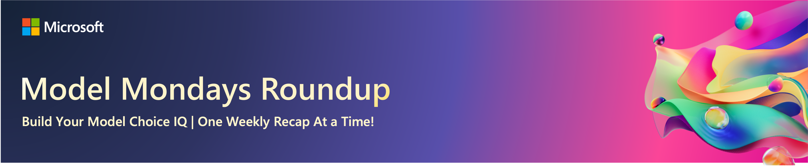
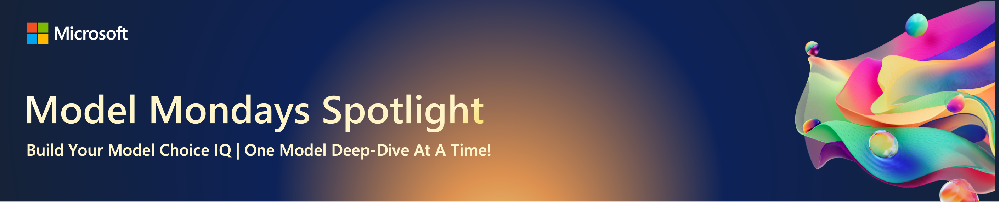
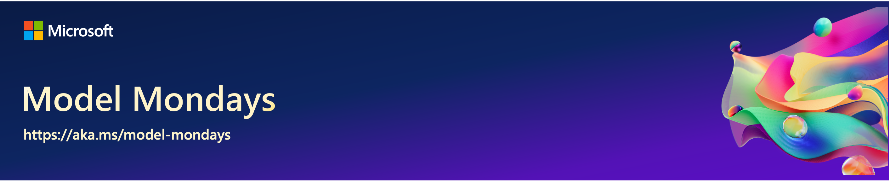

# S1:E1 - Hands on With GitHub Models

> [!IMPORTANT]  
> Join the Livestream on Microsoft Reactor - [every Mon 1:30pm ET](https://aka.ms/model-mondays/RSVP)  
> Join the Discord discussion on #model-mondays - [every Fri 1:30pm ET](https://aka.ms/model-mondays/chat)  
> Download the Presentation for this episode - [PDF here](https://speakerdeck.com/nitya/model-mondays-s1-e1-mar-10-2025)

---

Welcome to the kickoff episode for Season 1 of Model Mondays. In today's episode we looked at 5 key model announcements last week, and put the spotlight on the GitHub Models Marketplace for our deep-dive segment. Read on to learn more.

 

## Model Roundup

**Here are the 5 model-related announcements we covered this week**

1. 
1.
1.
1.
1.  

 

## Model Spotlight

This week, we put the spotlight on [GitHub Models](https://github.com/marketplace/models) with a 15-minute tour of the key features and workflow that will take you from model discovery in the browser - to prototpe development in a code editor. 

By the end of this episode you should know:
1. What GitHub Models are, and why they matter.
1. How to get started with your first GitHub Model.
1. How to compare models for evaluating responses.
1. How to go from catalog (explore) to code (develop)
1. How to use Azure Inference API for easy model swap

> [!IMPORTANT]  
> Revisit this page on Friday for links to hands-on labs and resources that you can use to skill up on your own!

 

## Continue the Discussion

Join us on [the Azure AI Discord](https://aka.ms/model-mondays/discord) and share your ideas and questions on the `#model-mondays` channel anytime. What models or tools do you find valuable?
 

Join us on the [Discord Chat](https://aka.ms/model-mondays/chat) on Friday at 1:30pm ET · Watch more hands-on demos · Show us what you're building · Tell us what you'd like to see in future episodes.

 

## Model Spotlight Resources

Here are a few resources to help you jumpstart your journey into GitHub Models!

1. [Introducing GitHub Models](https://github.blog/news-insights/product-news/introducing-github-models/) - launch post, Aug 2024
1. [GitHub Models Marketplace](https://github.com/marketplace/models) - log in with a GitHub account and explore!
1. [GitHub Models Codespaces](https://github.com/github/codespaces-models) - quickstart repository with samples, cookbook
1. [GitHub Models Documentation](https://github.com/github/codespaces-models) - learn the key features and tools
1. [GitHub Models Discussions](https://github.com/orgs/community/discussions/categories/models?discussions_q=is%3Aopen+models+category%3AModels) - GitHub community forum for questions, comments

---